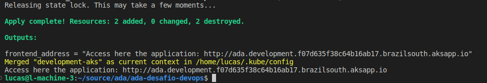
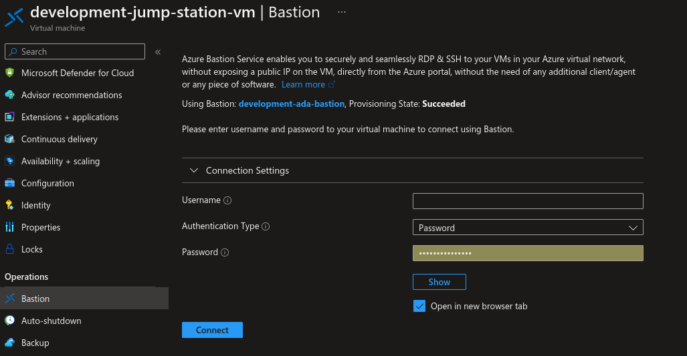
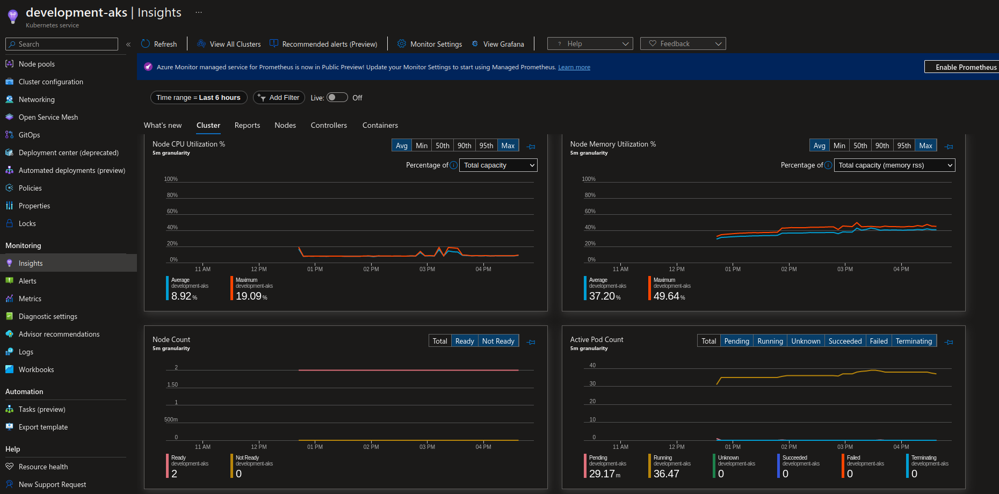
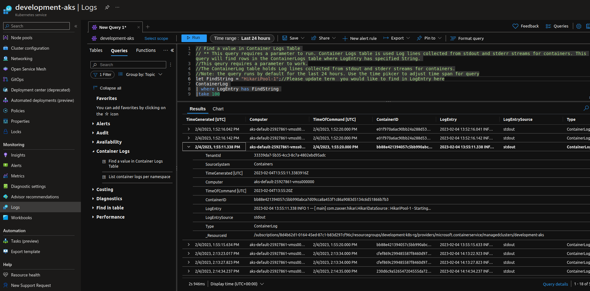

# Ada DevOps Desafio

## Pré requisitos:

- Azure cli
- Terraform
- Helm 3
- Docker Engine (caso seja necessário alterar alguma imagem de container)
- Conta na Azure

Os recursos que serão provisionados levam em consideração as cotas disponíveis para uma conta de estudante.

### Primeiro você precisa estar logado na sua conta

``` bash
az login
```

### Definir a susbcription e a Storage Account para o backend do terraform

Importante: o storage account deve ter um nome único:

Execute:

``` bash
SUBSCRIPTION_ID=<your-subscription-id>
STORAGE_ACCOUNT_NAME=<define-a-unique-name-here>
RESOURCE_GROUP_NAME=terraform-rg
```

## Provisionamento

``` bash
chmod +x ./infrastructure/provisioning_script.sh && \
./infrastructure/provisioning_script.sh $SUBSCRIPTION_ID $RESOURCE_GROUP_NAME $STORAGE_ACCOUNT_NAME
```

Após o provisionamento você poderá acessar a aplicação pelo link no output:



## Um usuário será criado quando a aplicação iniciar:

User : `ada-user`

Password: `ada-senha`

## Acessando o banco de dados

Se você precisar acessar o banco de dados, utilize a jump-box com Bastion. Toda a infraestrutura para isso já está provisionada. A base de dados não está acessível a partir da Internet.

Usuário e senha você pode encontrar na definição da jump-box [infrastructure/modules/network/jump-station.tf](./infrastructure/modules/network/jump-station.tf)


 
## Monitoramento

No cluster Kubernetes foi realizado o deploy do Prometheus, assim é possível conferir as métricas no Portal:



A coleta de logs também foi configurada:



## Destruindo os recursos

``` bash
cd ./infrastructure 
terraform destroy -auto-approve
az group delete --name $RESOURCE_GROUP_NAME --subscription $SUBSCRIPTION_ID --yes
```

## Provisionando a aplicação em um cluster local

``` BASH
BACKEND_IMAGE_VERSION=0.5.0
FRONTEND_IMAGE_VERSION=0.4.0
INGRESS_DNS=
API_BASE_URL=api.ada.development.$INGRESS_DNS
DATABASE_SERVER_URL=
DATABASE_NAME=
DATABASE_USERNAME=
DATABASE_PASSWORD=

 
helm upgrade ada-backend ./backend/app/charts/api/ \
  --values ./backend/app/charts/api/environments/development/values.yaml \
  --set image.version=$BACKEND_IMAGE_VERSION \
  --set ingress.dnsZone=$INGRESS_DNS \
  --set envVariables.SPRING_DATASOURCE_URL="jdbc:mysql://$DATABASE_SERVER_URL:3306/$DATABASE_NAME" \
  --set envVariables.SPRING_DATASOURCE_USERNAME=$DATABASE_USERNAME \
  --set envVariables.SPRING_DATASOURCE_PASSWORD=$DATABASE_PASSWORD \
  --create-namespace --namespace backend --install

helm upgrade ada-frontend ./frontend/app/charts/frontend/ \
--values ./frontend/app/charts/frontend/environments/development/values.yaml \
--set image.version=$FRONTEND_IMAGE_VERSION \
--set ingress.dnsZone=$INGRESS_DNS \
--set envVariables.APP_API_BASE_URL=$API_BASE_URL \
--create-namespace --namespace frontend --install
```
